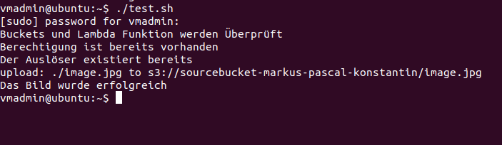

# Dokumentation Bild verkleinern

## Erste Schritte
---
Wir haben als erstes uns einen Plan gemacht wie wir beginnen wollen & was wir alles brauchen.

* Repository erstellt und aufgesetzt um entsprechend mit Develop Branch arbeiten zu können.
* Was für Files mit welchem Inhalt benötigen wir? 
* Mal Template Files erstellt, welche allenfalls später ersetzt/gelöscht/erweitert wurden etc.

Das weitere Vorgehen werden wir nach gewissen Meilensteinen in der Entwicklung erläutern. 

### Beschaffung des benötigten Wissen zur Implementierung
Als erstens haben wir einfach mal diverse Ressourcen im Internet durchforstet. Noch nichts ganz konkretes, sondern einfach mal welche Informationen & Seiten uns nützlich sein könnten und welche änhlichen Themen/Codeschniepsel es bereits gibt.

Dann haben wir angefangen, die ersten Dinge zu implementieren, oder es zumindest mal versucht. Pascal hat eine Funktionalität zur Bilder-Verkleinerung in Python getestet, bevor wir es mit C# probiert haben. Konstantin hat am Anfang noch versucht gehabt, ein Skript zur automatischen Session-Token Aktualisierung zu schreiben, was wir dann aber aufgegeben haben, da es nicht funktionierte. Markus hat mit der Dokumentation angefangen und ebenfalls nach Möglichkeiten gesucht, die Aufgabenstellung umzusetzen. 

## Planänderung

Wir haben mitten im Projekt beschlossen, unseren gewollten Lösungsweg nochmals zu überarbeiten und dementsprechend die Aufgabenverteilung nochmals neu eingeteilt. Die effektive Funktionalität hat Markus grundsätzlich programmiert, Konstantin hat beim Linux/Bash-Script geholfen und Pascal hatte seine Inputs zur Verkleinerungsfunktion noch mitgegeben.

## Shrink Funktion
---
Die Funktionalität wollte Markus ursprünglich in C# schreiben, was er auch geschafft hat, aber dann Probleme mit den NuGet Packages hatte und dem Namespace, wodurch AWS seinen Code nicht finden/benutzen konnte. Also haben wir schlussendlich doch noch einen sichereren Weg eingeschlagen und das ganze mit JavaScript gelöst.

Mit Hilfe des Internets konnte Markus mit ein bisschen Recherche zu gewissen Bereichen relativ schnell die Funktionalität implementieren. Beim Hochladen gab es zuerst noch Probleme, weil anfangs noch gewisse Node Modules gefehlt haben.

Um zu testen ob die Funktionalität, also nur die von index.js nicht das init.sh, überhaupt funktioniert, haben wir Buckets über die UI erstellt, das gleiche für die EventListeners.

Das hat leider nicht auf Anhieb funktioniert, da man im ZIP-File nebst dem Code, auch die ganzen Node-Module hätte mitgeben müssen. (Weil gewisse Funktionen im index.js darauf zugreifen).

Nachdem wir das gemacht haben, hat bei einem 2. Test das Hochladen & Resizing funktioniert.

## Testing mit der Bash-Funktion

Documentation for S3 Image Resizing Code
========================================

This code is designed to resize an image stored in an Amazon S3 bucket and save the resized version to a different S3 bucket. The code is written in JavaScript and uses the following libraries:

*   `aws-sdk`: This is the AWS SDK for JavaScript, which allows the code to interact with various AWS services, including S3.
*   `util`: This is a built-in Node.js library that provides utility functions, such as the `inspect` function used in this code to print objects in a more readable format.
*   `sharp`: This is an image processing library that provides functions for resizing images and converting them to different formats.

The code exports a single function, `handler`, which is intended to be used as an AWS Lambda function. When the function is invoked, it reads options from an `event` object and performs the following steps:

1.  It reads the name of the source bucket (where the original image is stored) and the source key (the file path of the original image) from the `event` object.
2.  It decodes the URL-encoded key and removes any `+` characters, which may be present in the key if it contains spaces.
3.  It defines the name of the destination bucket (where the resized image will be saved) and the destination key (the file path of the resized image). The destination key is constructed by adding the prefix "resized-" to the source key.
4.  It checks the file type of the original image by examining the file extension of the source key. If the file type is not "jpg" or "png", the function ends.
5.  It retrieves the original image from the source bucket.
6.  It uses the `sharp` library to resize the image to a width of 200 pixels and convert it to a buffer (a chunk of data in memory).
7.  It saves the resized image to the destination bucket.

In conclusion, this code provides a simple way to automatically resize images stored in S3 and save the resized versions to a different bucket. It could be used, for example, to create a thumbnail version of each image uploaded to a bucket, or to ensure that all images in a bucket are a consistent size.

AWS S3 and Lambda Setup Script
==============================

This script is used to set up the necessary AWS S3 and Lambda resources for a specific use case. The script performs the following actions:

1.  Check if the S3 buckets `sourcebucket-markus-pascal-konstantin` and `destination-markus-pascal-konstantin` exist. If either of them do not exist, the script creates them.
2.  Check if the Lambda function `shrinkFunction-markus-pascal-konstantin` exists. If it does not exist, the script creates it using the runtime `nodejs18.x` and the role `LabRole`.
3.  Check if the necessary permissions have been granted to the Lambda function to access the `sourcebucket-markus-pascal-konstantin` bucket. If the permissions have not been granted, the script grants them.
4.  Check if the necessary trigger has been set up to invoke the Lambda function when an object is created in the `sourcebucket-markus-pascal-konstantin` bucket. If the trigger does not exist, the script creates it.

Usage
-----

To use the script, follow these steps:

1.  Make sure you have the necessary AWS CLI credentials configured on your system.
2.  Navigate to the directory where the script is stored in a terminal window.
3.  Set the executable permission for the script by running `chmod 777 init.sh`.
4.  Run the script by typing `./init.sh`.

By default, the script uploads an image file called `image.jpg` to the `sourcebucket-markus-pascal-konstantin` bucket. You can specify a different image file by providing the file name as an argument when running the script, like this: `./init.sh myImage.jpg`.

Notes
-----

*   The script assumes that the `LabRole` IAM role has already been created. Make sure to replace the `123456789012` in the script with your own AWS account number.
*   The script uses the `jq` command to parse the output of the `aws sts get-caller-identity` command. Make sure you have `jq` installed on your system.
*   The script uses the `fileb://` prefix to reference the `archive.zip` file in the `aws lambda create-function` command. This prefix tells the AWS CLI to treat the path as a local file path rather than a URL.
*   The script redirects the output of the `aws lambda add-permission` command to `/dev/null` to suppress the output. This is done to prevent the script from printing the JSON representation of the created permission policy to the terminal.

Probleme
----
* Relativ oft Ansatz zur Lösung gewechselt, viel Zeit verloren dadurch
* Öfters waren Error Messages nicht all zu aussagend, weshalb die Lösungssuche entsprechend länger ging.

Input von Markus:

Einer der Meldung beim erstellen der Lambda funktion war: 'InvalidArgument'. Also hab ich gesucht was wohl an dem Befehl flasch sein könnte. Nach mehreren Stunden und Nervenzusammenbrüche hab ich herausgefunden das der Fehler nicht direkt beim code lag. Das Problem war die AccountNummer die man mitgeben muss. Die war falsch deswegen konnte der Befehl nicht ausgeführt werden. 

So Dinge haben mich wirklich eine Menge Zeit gekostet aber umso bessser war dann das Gefühl als alles einmal lief.

* Markus konnte das Bash-File ausführen
* Pascal aus irgendeinem Grund nicht?

Weitere Anmerkungen
---
* Fehlende/Mangel Commits im Repository
  
 Wir wollten zuerst für mehr Übersicht und mehr Struktur als Branching-Konzept das Repository nach Gitflow aufsetzen, also nicht nur master und develop Branch sondern auch feature, releases, hotfixes etc. (auch wenn wir wahrscheinlich nur feature Branches gebraucht hätten). Bei der Konfiguration scheint etwas schiefgelaufen zu sein, weshalb wir kurzfristig gegen Ende einfach alles in ein neues Repository packen mussten.

* Wechsel zwischen Deutsch/Englisch:
  
Wir hatten unter der Gruppe Unklarheiten gehabt ob die Dokumentation (zumindest die technische Anleitung) auf Englisch oder Deutsch sein sollte, da zwei von uns im Betrieb alles auf Englisch kommentieren müssen im Code & teils auch Dokumentationen in Englisch verfassen mussten. Aus diesem Grund ist in dieser Dokumentation alles beschreibende zu unserem Vorgehen auf Deutsch und eigentlich alles was eine Anleitung zur Nutzung darstellen sollte, auf Englisch. Abgesehen von zeitlichen Gründen, scheint es keine Angabe gehabt zu haben, dass alles auf Deutsch sein muss, weshalb wir beschlossen haben, das Englische so zu belassen.
